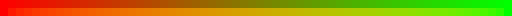
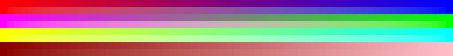
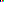
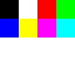
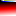
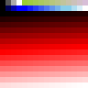
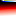
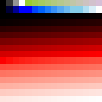

# LowTexPal

A minimalistic CLI tool for creating palette texture images for low-poly 3D graphics. Each pixel in the generated PNG represents a distinct color in your palette, perfect for UV mapping in low-poly models.

## Usage

LowTexPal builds palettes incrementally - each command adds colors to an existing file (or creates a new one). Colors can be added individually or as gradients using hex codes or CSS color names.

### Perceptual Gradients

Gradients support three colorspaces: `rgb` (default), `oklab`, and `oklch`. OKLab produces perceptually uniform gradients without muddy midpoints.

```bash
# RGB gradient (muddy middle)
lowtexpal -f pal.png add-gradient --start-color red --end-color lime --steps 16

# OKLab gradient (smooth, perceptually uniform)
lowtexpal -f pal.png add-gradient --start-color red --end-color lime --steps 16 --colorspace oklab
```



*Left: RGB (muddy). Right: OKLab (smooth). OKLab preserves vibrancy and handles complementary colors, high saturation, and extreme lightness ranges better.*



*Top row (RGB): Red↔Blue, Magenta↔Lime, Yellow↔Cyan, DarkRed↔Pink. Bottom row: Same gradients in OKLab.*

## Examples

```
lowtexpal -f example_01.png add-color --color "#000000"
lowtexpal -f example_01.png add-color --color "#ffffff"
lowtexpal -f example_01.png add-color --color "#ff0000"
lowtexpal -f example_01.png add-color --color "#00ff00"
lowtexpal -f example_01.png add-color --color "#0000ff"
lowtexpal -f example_01.png add-color --color "#ffff00"
lowtexpal -f example_01.png add-color --color "#ff00ff"
lowtexpal -f example_01.png add-color --color "#00ffff"
```



Scaled up:



```
#!/bin/sh

png="example_02.png"
rm ${png}

lowtexpal -f ${png} add-color --color "black"
lowtexpal -f ${png} add-color --color "white"
lowtexpal -f ${png} add-color --color "red"
lowtexpal -f ${png} add-color --color "lime"
lowtexpal -f ${png} add-color --color "blue"
lowtexpal -f ${png} add-color --color "yellow"
lowtexpal -f ${png} add-color --color "fuchsia"
lowtexpal -f ${png} add-color --color "cyan"

gm convert ${png} -filter point -resize 128x128 big_${png}
```


Scaled up:


```
#!/bin/sh

png="example_03.png"
rm ${png}

lowtexpal -f ${png} add-gradient --start-color "black" --end-color "white" --steps "4"
lowtexpal -f ${png} add-gradient --start-color "yellowgreen" --end-color "thistle" --steps "12"

lowtexpal -f ${png} add-gradient --start-color "black" --end-color "blue" --steps "4"
lowtexpal -f ${png} add-gradient --start-color "blue" --end-color "skyblue" --steps "8"
lowtexpal -f ${png} add-gradient --start-color "skyblue" --end-color "white" --steps "4"

lowtexpal -f ${png} add-gradient --start-color "black" --end-color "red" --steps "112"
lowtexpal -f ${png} add-gradient --start-color "red" --end-color "white" --steps "112"

gm convert ${png} -filter point -resize 128x128 big_${png}
```



Scaled up:



Same gradients using OKLab colorspace:

```
#!/bin/sh

png="example_03b.png"
rm -f ${png}

lowtexpal -f ${png} add-gradient --start-color "black" --end-color "white" --steps "4" --colorspace oklab
lowtexpal -f ${png} add-gradient --start-color "yellowgreen" --end-color "thistle" --steps "12" --colorspace oklab

lowtexpal -f ${png} add-gradient --start-color "black" --end-color "blue" --steps "4" --colorspace oklab
lowtexpal -f ${png} add-gradient --start-color "blue" --end-color "skyblue" --steps "8" --colorspace oklab
lowtexpal -f ${png} add-gradient --start-color "skyblue" --end-color "white" --steps "4" --colorspace oklab

lowtexpal -f ${png} add-gradient --start-color "black" --end-color "red" --steps "112" --colorspace oklab
lowtexpal -f ${png} add-gradient --start-color "red" --end-color "white" --steps "112" --colorspace oklab

gm convert ${png} -filter point -resize 128x128 big_${png}
```



Scaled up:



